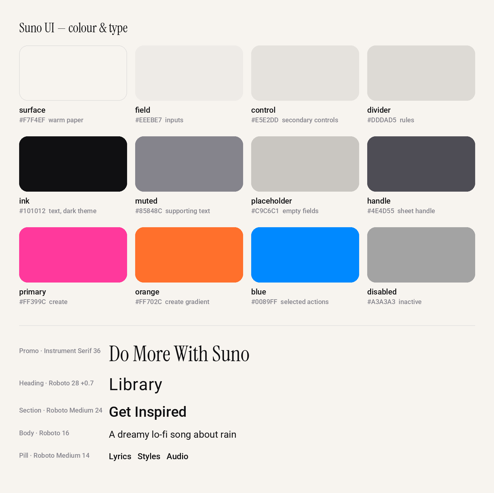

<p align="center">
  <a href="https://suno-ui.edgeone.cool"></a>
</p>

<h1 align="center">Suno UI</h1>

<p align="center">
  <a href="https://suno-ui.edgeone.cool"></a>
</p>

<p align="center">
  A high-fidelity, interactive recreation of Suno's mobile interface — real forms, real playback, running in your browser.<br>
  <a href="DESIGN.md">DESIGN.md</a> · <a href="#design-notes">Design notes</a> · <a href="#explore-the-prototype">Explore</a> · <a href="#run-locally">Run locally</a> · <a href="#scope-and-limitations">Scope</a> · <a href="https://github.com/migrant620/awesome-app-design-md">More apps →</a>
</p>

---

Created to help people get to know Suno through a hands-on exploration of its interface, and to appreciate the details that make music creation feel inviting. For the full experience of turning your ideas into music, explore [Suno](https://suno.com).

Explore editable creation forms, a sample music library, and working audio playback. Creation uses prerecorded examples; it does not generate music or connect to a Suno account.

## Design notes

What makes Suno's interface work, and what this recreation had to get right.

**Warm paper, not screen white.** Surfaces are a warm `#F7F4EF` with near-black `#101012` text, and the creation screen sits on a softly drifting, grainy aura. It feels closer to a notebook than a form, which suits a tool that starts from a sentence.

**Start with a sentence, add structure when you want it.** The prompt is one free-text field. Lyrics, Styles and Audio wait around it as dashed pills — visibly optional, one tap away — and Advanced mode unfolds them into full editors only when you ask.

**One loud gradient for one job.** A pink-to-orange gradient (`#FF399C` → `#FF702C`) is spent on the moment of making: the Create button and the model selector's outline. Selected secondary actions use a plain blue, so the gradient never has to compete.

**The player borrows the artwork.** Opening a song turns the whole screen dark and paints it from the cover, so the controls sit on the mood of the track rather than on a neutral panel.

**A workhorse sans with a serif for occasions.** Roboto does the work — 28 dp headings with slight tracking, medium-weight section titles and pills — while Instrument Serif appears only for promotional moments, which keeps them feeling special.

**Comfortable touch everywhere.** Pills are 40 dp tall inside 48 dp touch rows, icon buttons are 48 × 48, and sheets share one pattern: rounded top corners, a short handle and an explicit way out.

## Design system at a glance

<p align="center"></p>

The full token set — colours, dark theme, type scale, spacing and component notes — is in [DESIGN.md](DESIGN.md).

## Explore the prototype

| Area | Things to try |
|---|---|
| Create | Switch between Simple and Advanced, edit lyrics and styles, open the text editors, and save a local example to your library. |
| Search | Browse the sample catalogue and open Morning Light in the full player. |
| Player | Play and pause sample recordings, seek, change tracks, and open song actions. |
| Library | Find local examples, like songs, and organise them into playlists. |
| Hooks | Browse sample music clips and the inspiration entries. |
| Profile | Edit local profile details and explore settings and subscription screens. |

### In the details

A closer look at the current edition: editable drafts, persistent playlists, and bundled typography across the interface.

### A first walkthrough

1. Open **Search**, then open **Morning Light** in the player.
2. Play and pause the recording, then close the player.
3. Open **Create**, switch to **Advanced**, and enter lyrics, styles, and a title.
4. Choose **Create**, select a prerecorded example, and save it to **Library**.

The example keeps your entered details. The lyrics and prompt do not change its audio. Profile edits, playlists, and other local changes do not update the official Suno service.

## Run locally

Use Node.js 22.13 or newer in the Node.js 22 release line, with npm.

```bash
npm ci --ignore-scripts
npm run web
```

Open the local URL printed by Expo. Dependency installation requires an internet connection. No Suno credentials or API key are required for the sample catalogue.

### Build for the web

```bash
npm run typecheck
npm run build:web
```

The static output is written to `dist/`. Serve that directory over HTTP or HTTPS; opening `index.html` directly as a local file is not supported. Camera and microphone features depend on browser permissions and a secure context, such as HTTPS or localhost.

## Scope and limitations

- **Mobile layout on the web.** At wider viewport sizes, the interface remains a centred column up to 480 CSS pixels wide. It is not a separate desktop dashboard.
- **Sample content.** Songs, artwork, profiles, and social activity use demonstration content. The sample catalogue is limited.
- **Local simulation.** Music generation, credits, subscriptions, and social actions are simulated. No purchase or official Suno account change occurs.
- **Browser storage.** Local data belongs to this browser and origin. Clearing site data removes it; it does not sync between devices.
- **Validation scope.** Selected flows and responsive layouts have been checked in Chromium. This does not establish complete feature coverage, full visual equivalence, Safari/Firefox compatibility, or native Android/iOS acceptance.

## Commission a prototype

Have an app whose screens you want to put in front of your team, a client or investors? I recreate chosen app interfaces and flows as high-fidelity, interactive prototypes and hand over the source code. [Open an issue](https://github.com/migrant620/suno-ui/issues/new?title=Prototype%20enquiry) with the app, the flow you need and your timeline.

## License

The prototype's original code and materials are **source-available for noncommercial self-directed study and research only**, under the [M620 Study and Research License](LICENSE). Commercial products, business use, client deliverables, and hosted services are not permitted without a separate written license. Free access does not itself permit commercial use.

This is not an open-source license. Third-party components retain their own licenses.

## Attribution

This is an independent prototype by M620, not an official Suno product and not affiliated with or endorsed by Suno. Third-party names identify the interface being demonstrated.

Third-party components retain their own licenses. See the [third-party notices](public/third-party-notices.txt); the Web build also serves this file at `/third-party-notices.txt`.
